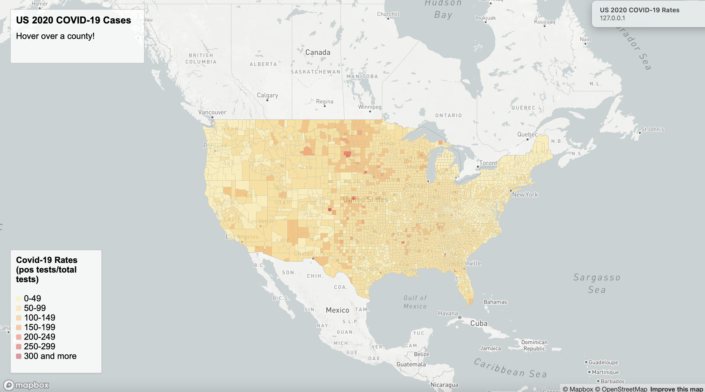

# Mapping 2020 COVID-19 in the United States by County 

Mapping the pandemic allows us to derive meaningful insight into how the virus spreads. The goal of this project is to essentially visualize which counties had more positive COVID cases along with which counties had a higher rate of positive COVID cases. Within this repository there are two maps. Map 1 is a choropleth map depicting the COVID rates per county. COVID rates are measured by the number positive test results divided by the county's population 2020. Map 2 is a proportional symbols map visualizing the number of COVID cases per county in 2020. By comparing these two maps, conclusions can be drawn about the success of prevention methods such as social distancing, mask wearing, and limiting social gatherings. For example, counties that have a large number of cases but a low COVID rate most likely were successful in their prevention methods, and they probably just have a large population.

## Map 1
As mentioned above, [Map 1](https://zoedooley00.github.io/mapping_covid19/map1.html) is a choropleth map visualizing COVID rates per county. The COVID data for this map was derived from the [New York Times](https://github.com/nytimes/covid-19-data/blob/43d32dde2f87bd4dafbb7d23f5d9e878124018b8/live/us-counties.csv) and the population estimates per county were derived from the [2018 ACS 5 Year Estimates](https://www.census.gov/geographies/mapping-files/time-series/geo/carto-boundary-file.html). The rates were calculated by dividing the number of positive COVID cases by the population of each county. The data was downloaded as a shapefile and converted to geojson format. The data was then cleaned to get rid of unnecessary columns and was converted to an Albers projection system. Lastly, the data was imported into [Mapshaper](https://mapshaper.org/) so that the geometric shapes (counties) within the data were simplified. The data is saved under the assets folder as covid_rates_2020_simplified.geojson. Using a Mapbox access token, I was able to create the map using javascript, html, and a style sheet. The map itself allows viewers to scroll their mouse over any county to find out the county name along with its case rate. Counties painted in a darker shade of orange have a larger case rate than those with shades of lighter orange. The legend on the bottom left hand side coordinates the color of each county with a rate range for that given shade.

